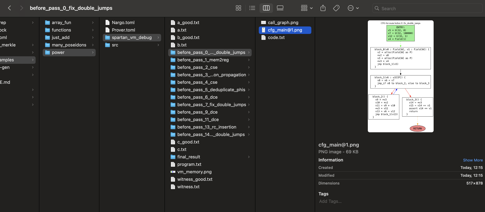

Spartan VM project

Noir code -> R1CS and witness

## Test status

[Latest test status](https://github.com/reilabs/spartan-vm/blob/main/STATUS.md)

## How to install
 
We currently need a custom Noir branch located in the shared parent folder (see Cargo.toml to see where exactly)
 - https://github.com/reilabs/noir/tree/spartan-vm


## How to run

```
RUST_LOG=info RUST_BACKTRACE=1 cargo run --release -- --root=noir_examples/power --public-witness 1 2 3 5
```


## CLI flags

### Mandatory
- **--root PATH**: The root directory of the Noir project to run.
  - Example: `--root noir_examples/power`

- **--public-witness <VALUES>...**: Zero or more public witness values.
     Values should be field elements parseable for BN254 (e.g., decimal integers)
  - Example: `--public-witness 1 2 3 5`

### Optional

- **--draw-cfg**: Generate CFG and call graph images to `spartan_vm_debug`.
  - Requires Graphviz (`dot`) installed and available on PATH.

## Debugging instruction

Running the VM creates a folder in the provided root path, called `spartan_vm_debug`.
It generates a folder structure of the executed passes and creates the diagrams of SSA, which allows for easier debugging.



Important! A prerequisite for running this debug mode is to have Graphviz installed.

On macOS: `brew install graphviz`. 

`RUST_LOG=info RUST_BACKTRACE=1 cargo run --release -- --root=noir_examples/power --public-witness 1 2 3 5 --draw-graphs`